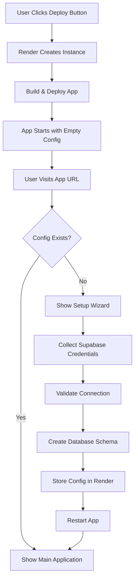

# Render Deployment Technical Specification

## Executive Summary

This document provides the complete technical specification for enabling one-click deployment of the Bylaws Amendment Tracker to Render with a web-based setup wizard. The goal is to make deployment so simple that non-technical users can deploy their own instance in under 5 minutes without GitHub accounts, CLI tools, or technical knowledge.

## Deployment Architecture

### Current State Analysis

**Existing Setup:**
- Repository: GitHub-based
- Current Deployment: `bylaws-amendment-tracker.onrender.com`
- Tech Stack: Node.js + Express + Supabase
- Required Environment Variables:
  - `SUPABASE_URL`
  - `SUPABASE_ANON_KEY`
  - `GOOGLE_DOC_ID` (optional)
  - `PORT` (auto-set by Render)
  - `NODE_ENV` (set to production)

**Existing Configuration:**
```yaml
# render.yaml (current)
services:
  - type: web
    name: bylaws-amendment-tracker
    env: node
    plan: free
    buildCommand: npm install
    startCommand: npm start
    envVars:
      - key: NODE_ENV
        value: production
      - key: SUPABASE_URL
        sync: false
      - key: SUPABASE_ANON_KEY
        sync: false
      - key: GOOGLE_DOC_ID
        sync: false
      - key: PORT
        value: 3000
```

## Recommended Deployment Flow: "Render Blueprint + Setup Wizard"

### User Experience Journey

1. **Landing Page** → User clicks "Deploy to Render" button
2. **Render Dashboard** → User creates Render account (if needed) and clicks "Deploy"
3. **Build Process** → Render builds the app (2-3 minutes)
4. **First Visit** → User visits their app URL (e.g., `https://my-bylaws.onrender.com`)
5. **Setup Wizard** → Beautiful guided setup collects Supabase credentials
6. **Database Init** → Wizard creates database schema automatically
7. **Configuration Test** → Wizard validates the setup
8. **Launch** → User is redirected to working application

### Technical Flow



## Implementation Components

### 1. Enhanced Render Blueprint (`render.yaml`)

**Location:** `/render.yaml` (project root)

```yaml
services:
  - type: web
    name: bylaws-amendment-tracker
    env: node
    plan: free
    region: oregon  # or closest to user
    buildCommand: npm install
    startCommand: npm start

    # Auto-scaling (optional for paid plans)
    autoDeploy: true

    # Health check endpoint
    healthCheckPath: /health

    # Environment variables with sensible defaults
    envVars:
      - key: NODE_ENV
        value: production

      - key: PORT
        value: 10000  # Render's default

      - key: APP_URL
        generateValue: true  # Auto-generated based on service URL

      # These will be set via setup wizard
      - key: SUPABASE_URL
        sync: false

      - key: SUPABASE_ANON_KEY
        sync: false

      - key: GOOGLE_DOC_ID
        sync: false

      # Session security (auto-generated)
      - key: SESSION_SECRET
        generateValue: true

      # Setup wizard flag (indicates first-run state)
      - key: SETUP_COMPLETED
        value: "false"

# Optional: Include static site for landing page
# - type: static
#   name: bylaws-landing
#   buildCommand: npm run build:landing
#   staticPublishPath: ./landing/dist
```

**Key Features:**
- `healthCheckPath`: Ensures app is healthy before serving traffic
- `generateValue`: Render auto-generates secure values
- `SETUP_COMPLETED`: Flag to detect first-run state
- `autoDeploy`: Auto-deploys on git push (optional)

### 2. First-Run Detection Middleware

**Location:** `/src/middleware/first-run-detector.js`

```javascript
/**
 * First-Run Detection Middleware
 *
 * Detects if the app is in an unconfigured state and redirects
 * to the setup wizard.
 */

const isConfigured = () => {
  // Check if critical environment variables are set
  const hasSupabase =
    process.env.SUPABASE_URL &&
    process.env.SUPABASE_URL !== 'https://your-project.supabase.co' &&
    process.env.SUPABASE_ANON_KEY &&
    process.env.SUPABASE_ANON_KEY !== 'your-anon-key-here';

  // Check setup completion flag
  const setupCompleted = process.env.SETUP_COMPLETED === 'true';

  return hasSupabase && setupCompleted;
};

const firstRunDetector = (req, res, next) => {
  // Skip check for setup wizard routes and health check
  const exemptPaths = ['/setup', '/api/setup', '/health', '/favicon.ico'];
  const isExempt = exemptPaths.some(path => req.path.startsWith(path));

  if (isExempt) {
    return next();
  }

  // Redirect to setup wizard if not configured
  if (!isConfigured()) {
    return res.redirect('/setup');
  }

  next();
};

module.exports = {
  firstRunDetector,
  isConfigured
};
```

### 3. Setup Wizard Routes

**Location:** `/src/routes/setup.js`

```javascript
/**
 * Setup Wizard Routes
 *
 * Provides web-based configuration for first-time deployment
 */

const express = require('express');
const router = express.Router();
const { createClient } = require('@supabase/supabase-js');
const fs = require('fs').promises;
const path = require('path');

// Render API client (for updating env vars)
const RenderAPI = require('../services/render-api');

// GET /setup - Show setup wizard
router.get('/', (req, res) => {
  res.render('setup-wizard', {
    title: 'Setup Your Bylaws Tracker',
    step: req.query.step || '1',
    error: req.query.error || null
  });
});

// POST /api/setup/validate-supabase - Validate Supabase connection
router.post('/api/setup/validate-supabase', async (req, res) => {
  try {
    const { supabaseUrl, supabaseKey } = req.body;

    // Validate format
    if (!supabaseUrl.includes('.supabase.co')) {
      return res.json({
        success: false,
        error: 'Invalid Supabase URL format. Should be: https://yourproject.supabase.co'
      });
    }

    if (supabaseKey.length < 50) {
      return res.json({
        success: false,
        error: 'Invalid Supabase key. It should be much longer.'
      });
    }

    // Test connection
    const testClient = createClient(supabaseUrl, supabaseKey);

    // Try to query (this will fail if credentials are wrong)
    const { data, error } = await testClient
      .from('bylaw_sections')
      .select('count')
      .limit(1);

    // If table doesn't exist, that's okay - we'll create it
    // Only error if authentication failed
    if (error && error.message.includes('JWT')) {
      return res.json({
        success: false,
        error: 'Invalid credentials. Please check your Supabase URL and key.'
      });
    }

    res.json({
      success: true,
      message: 'Supabase connection validated successfully!'
    });

  } catch (error) {
    res.json({
      success: false,
      error: `Connection failed: ${error.message}`
    });
  }
});

// POST /api/setup/create-schema - Create database schema
router.post('/api/setup/create-schema', async (req, res) => {
  try {
    const { supabaseUrl, supabaseKey } = req.body;

    // Create Supabase client
    const supabase = createClient(supabaseUrl, supabaseKey);

    // Read schema file
    const schemaPath = path.join(__dirname, '../../database/schema.sql');
    const schemaSQL = await fs.readFile(schemaPath, 'utf8');

    // Execute schema creation
    // Note: Supabase doesn't support multi-statement execution via JS client
    // We need to use the Supabase Management API or guide user to SQL editor

    res.json({
      success: true,
      message: 'Schema created successfully',
      instructions: {
        method: 'automatic',
        sql: schemaSQL
      }
    });

  } catch (error) {
    res.json({
      success: false,
      error: `Schema creation failed: ${error.message}`
    });
  }
});

// POST /api/setup/complete - Finalize setup
router.post('/api/setup/complete', async (req, res) => {
  try {
    const {
      supabaseUrl,
      supabaseKey,
      googleDocId,
      organizationName
    } = req.body;

    // For Render deployment, we need to:
    // 1. Update environment variables via Render API
    // 2. Trigger app restart

    const renderServiceId = process.env.RENDER_SERVICE_ID;
    const renderApiKey = process.env.RENDER_API_KEY;

    if (renderServiceId && renderApiKey) {
      // Update via Render API
      const renderAPI = new RenderAPI(renderApiKey);

      await renderAPI.updateEnvVars(renderServiceId, {
        SUPABASE_URL: supabaseUrl,
        SUPABASE_ANON_KEY: supabaseKey,
        GOOGLE_DOC_ID: googleDocId || '',
        SETUP_COMPLETED: 'true',
        ORGANIZATION_NAME: organizationName || 'My Organization'
      });

      // Trigger restart
      await renderAPI.restartService(renderServiceId);

      res.json({
        success: true,
        message: 'Configuration saved. Restarting application...',
        redirectUrl: '/',
        waitTime: 30000  // Wait 30 seconds for restart
      });
    } else {
      // Fallback: Write to .env file (works for local development)
      const envPath = path.join(__dirname, '../../.env');
      const envContent = `
SUPABASE_URL=${supabaseUrl}
SUPABASE_ANON_KEY=${supabaseKey}
GOOGLE_DOC_ID=${googleDocId || ''}
SETUP_COMPLETED=true
ORGANIZATION_NAME=${organizationName || 'My Organization'}
APP_URL=${process.env.APP_URL || 'http://localhost:3000'}
PORT=${process.env.PORT || 3000}
NODE_ENV=production
      `.trim();

      await fs.writeFile(envPath, envContent);

      res.json({
        success: true,
        message: 'Configuration saved. Please restart the application manually.',
        redirectUrl: '/',
        manualRestart: true
      });
    }

  } catch (error) {
    res.json({
      success: false,
      error: `Setup completion failed: ${error.message}`
    });
  }
});

module.exports = router;
```

### 4. Render API Service

**Location:** `/src/services/render-api.js`

```javascript
/**
 * Render API Service
 *
 * Interacts with Render's API to update environment variables
 * and trigger service restarts.
 *
 * API Docs: https://api-docs.render.com/
 */

const https = require('https');

class RenderAPI {
  constructor(apiKey) {
    this.apiKey = apiKey;
    this.baseUrl = 'api.render.com';
  }

  /**
   * Make API request to Render
   */
  async request(method, path, body = null) {
    return new Promise((resolve, reject) => {
      const options = {
        hostname: this.baseUrl,
        port: 443,
        path: path,
        method: method,
        headers: {
          'Authorization': `Bearer ${this.apiKey}`,
          'Content-Type': 'application/json',
          'Accept': 'application/json'
        }
      };

      const req = https.request(options, (res) => {
        let data = '';

        res.on('data', (chunk) => {
          data += chunk;
        });

        res.on('end', () => {
          try {
            const parsed = JSON.parse(data);

            if (res.statusCode >= 200 && res.statusCode < 300) {
              resolve(parsed);
            } else {
              reject(new Error(`Render API error: ${parsed.message || data}`));
            }
          } catch (e) {
            reject(new Error(`Failed to parse response: ${data}`));
          }
        });
      });

      req.on('error', (error) => {
        reject(error);
      });

      if (body) {
        req.write(JSON.stringify(body));
      }

      req.end();
    });
  }

  /**
   * Update environment variables for a service
   */
  async updateEnvVars(serviceId, envVars) {
    const envVarArray = Object.entries(envVars).map(([key, value]) => ({
      key,
      value
    }));

    return this.request(
      'PUT',
      `/v1/services/${serviceId}/env-vars`,
      { envVars: envVarArray }
    );
  }

  /**
   * Restart a service
   */
  async restartService(serviceId) {
    return this.request(
      'POST',
      `/v1/services/${serviceId}/restart`,
      {}
    );
  }

  /**
   * Get service details
   */
  async getService(serviceId) {
    return this.request(
      'GET',
      `/v1/services/${serviceId}`
    );
  }
}

module.exports = RenderAPI;
```

### 5. Setup Wizard UI

**Location:** `/views/setup-wizard.ejs`

```html
<!DOCTYPE html>
<html lang="en">
<head>
  <meta charset="UTF-8">
  <meta name="viewport" content="width=device-width, initial-scale=1.0">
  <title><%= title %></title>
  <style>
    * { margin: 0; padding: 0; box-sizing: border-box; }

    body {
      font-family: -apple-system, BlinkMacSystemFont, 'Segoe UI', Roboto, Oxygen, Ubuntu, sans-serif;
      background: linear-gradient(135deg, #667eea 0%, #764ba2 100%);
      min-height: 100vh;
      display: flex;
      align-items: center;
      justify-content: center;
      padding: 20px;
    }

    .wizard-container {
      background: white;
      border-radius: 20px;
      box-shadow: 0 20px 60px rgba(0,0,0,0.3);
      max-width: 600px;
      width: 100%;
      padding: 40px;
    }

    .wizard-header {
      text-align: center;
      margin-bottom: 40px;
    }

    .wizard-header h1 {
      color: #333;
      font-size: 28px;
      margin-bottom: 10px;
    }

    .wizard-header p {
      color: #666;
      font-size: 16px;
    }

    .progress-bar {
      height: 4px;
      background: #e0e0e0;
      border-radius: 2px;
      margin-bottom: 30px;
      overflow: hidden;
    }

    .progress-fill {
      height: 100%;
      background: linear-gradient(90deg, #667eea, #764ba2);
      transition: width 0.3s ease;
    }

    .step {
      display: none;
    }

    .step.active {
      display: block;
      animation: fadeIn 0.3s ease;
    }

    @keyframes fadeIn {
      from { opacity: 0; transform: translateY(10px); }
      to { opacity: 1; transform: translateY(0); }
    }

    .form-group {
      margin-bottom: 24px;
    }

    label {
      display: block;
      color: #333;
      font-weight: 600;
      margin-bottom: 8px;
      font-size: 14px;
    }

    input[type="text"],
    input[type="url"],
    textarea {
      width: 100%;
      padding: 12px 16px;
      border: 2px solid #e0e0e0;
      border-radius: 8px;
      font-size: 15px;
      transition: border-color 0.2s;
    }

    input:focus,
    textarea:focus {
      outline: none;
      border-color: #667eea;
    }

    .help-text {
      font-size: 13px;
      color: #666;
      margin-top: 6px;
    }

    .help-text a {
      color: #667eea;
      text-decoration: none;
    }

    .help-text a:hover {
      text-decoration: underline;
    }

    .button-group {
      display: flex;
      gap: 12px;
      margin-top: 30px;
    }

    button {
      flex: 1;
      padding: 14px 24px;
      border: none;
      border-radius: 8px;
      font-size: 15px;
      font-weight: 600;
      cursor: pointer;
      transition: all 0.2s;
    }

    .btn-primary {
      background: linear-gradient(135deg, #667eea 0%, #764ba2 100%);
      color: white;
    }

    .btn-primary:hover {
      transform: translateY(-2px);
      box-shadow: 0 4px 12px rgba(102, 126, 234, 0.4);
    }

    .btn-secondary {
      background: #f5f5f5;
      color: #333;
    }

    .btn-secondary:hover {
      background: #e0e0e0;
    }

    .alert {
      padding: 12px 16px;
      border-radius: 8px;
      margin-bottom: 20px;
      font-size: 14px;
    }

    .alert-error {
      background: #fee;
      color: #c33;
      border: 1px solid #fcc;
    }

    .alert-success {
      background: #efe;
      color: #363;
      border: 1px solid #cfc;
    }

    .loading {
      display: none;
      text-align: center;
      padding: 20px;
    }

    .loading.active {
      display: block;
    }

    .spinner {
      border: 3px solid #f3f3f3;
      border-top: 3px solid #667eea;
      border-radius: 50%;
      width: 40px;
      height: 40px;
      animation: spin 1s linear infinite;
      margin: 0 auto 16px;
    }

    @keyframes spin {
      0% { transform: rotate(0deg); }
      100% { transform: rotate(360deg); }
    }

    .checklist {
      background: #f9f9f9;
      padding: 20px;
      border-radius: 8px;
      margin-top: 20px;
    }

    .checklist-item {
      display: flex;
      align-items: center;
      padding: 10px 0;
      border-bottom: 1px solid #e0e0e0;
    }

    .checklist-item:last-child {
      border-bottom: none;
    }

    .checklist-icon {
      width: 24px;
      height: 24px;
      border-radius: 50%;
      background: #e0e0e0;
      margin-right: 12px;
      display: flex;
      align-items: center;
      justify-content: center;
      font-size: 14px;
    }

    .checklist-icon.done {
      background: #4caf50;
      color: white;
    }
  </style>
</head>
<body>
  <div class="wizard-container">
    <div class="wizard-header">
      <h1>🏛️ Setup Your Bylaws Tracker</h1>
      <p>Let's get your system configured in just a few steps</p>
    </div>

    <div class="progress-bar">
      <div class="progress-fill" id="progressFill" style="width: 25%"></div>
    </div>

    <!-- Step 1: Welcome -->
    <div class="step active" id="step1">
      <h2>Welcome!</h2>
      <p style="color: #666; margin: 20px 0;">
        This wizard will help you configure your Bylaws Amendment Tracker.
        You'll need:
      </p>

      <div class="checklist">
        <div class="checklist-item">
          <div class="checklist-icon">1</div>
          <div>A Supabase account (free)</div>
        </div>
        <div class="checklist-item">
          <div class="checklist-icon">2</div>
          <div>Your Supabase project URL and key</div>
        </div>
        <div class="checklist-item">
          <div class="checklist-icon">3</div>
          <div>Optional: Google Doc ID for your bylaws</div>
        </div>
      </div>

      <div class="button-group">
        <button class="btn-primary" onclick="nextStep()">Get Started →</button>
      </div>
    </div>

    <!-- Step 2: Supabase Setup -->
    <div class="step" id="step2">
      <h2>Supabase Configuration</h2>
      <p style="color: #666; margin: 20px 0;">
        Enter your Supabase project credentials. Don't have one yet?
        <a href="https://supabase.com" target="_blank">Create a free project</a>
      </p>

      <div id="errorMsg"></div>

      <div class="form-group">
        <label for="supabaseUrl">Supabase URL</label>
        <input
          type="url"
          id="supabaseUrl"
          placeholder="https://yourproject.supabase.co"
          required
        >
        <p class="help-text">
          Find this in your Supabase project → Settings → API → Project URL
        </p>
      </div>

      <div class="form-group">
        <label for="supabaseKey">Supabase Anon Key</label>
        <input
          type="text"
          id="supabaseKey"
          placeholder="eyJhbGciOiJIUzI1NiIsInR5cCI6IkpXVCJ9..."
          required
        >
        <p class="help-text">
          Find this in your Supabase project → Settings → API → Project API keys → anon public
        </p>
      </div>

      <div class="button-group">
        <button class="btn-secondary" onclick="prevStep()">← Back</button>
        <button class="btn-primary" onclick="validateSupabase()">Validate & Continue →</button>
      </div>
    </div>

    <!-- Step 3: Database Setup -->
    <div class="step" id="step3">
      <h2>Database Setup</h2>
      <p style="color: #666; margin: 20px 0;">
        We'll now create the necessary database tables in your Supabase project.
      </p>

      <div id="dbErrorMsg"></div>

      <div class="checklist" id="schemaChecklist">
        <div class="checklist-item">
          <div class="checklist-icon" id="checkConnection">⏳</div>
          <div>Testing database connection...</div>
        </div>
        <div class="checklist-item">
          <div class="checklist-icon" id="checkSchema">⏳</div>
          <div>Creating database tables...</div>
        </div>
        <div class="checklist-item">
          <div class="checklist-icon" id="checkPermissions">⏳</div>
          <div>Setting up permissions...</div>
        </div>
      </div>

      <div class="loading" id="dbLoading">
        <div class="spinner"></div>
        <p>Setting up your database...</p>
      </div>

      <div class="button-group">
        <button class="btn-secondary" onclick="prevStep()">← Back</button>
        <button class="btn-primary" id="createSchemaBtn" onclick="createSchema()">Create Database →</button>
      </div>
    </div>

    <!-- Step 4: Optional Configuration -->
    <div class="step" id="step4">
      <h2>Additional Configuration</h2>
      <p style="color: #666; margin: 20px 0;">
        Optional: Configure Google Docs integration and organization details.
      </p>

      <div class="form-group">
        <label for="organizationName">Organization Name</label>
        <input
          type="text"
          id="organizationName"
          placeholder="My Organization"
        >
        <p class="help-text">
          This will be displayed in the application header
        </p>
      </div>

      <div class="form-group">
        <label for="googleDocId">Google Doc ID (Optional)</label>
        <input
          type="text"
          id="googleDocId"
          placeholder="1LdE2NGMOJ7BgV19V3Qb-hnN5VTmB5C_Hh6heemqxviA"
        >
        <p class="help-text">
          Extract from your Google Doc URL: docs.google.com/document/d/<strong>[THIS_PART]</strong>/edit
        </p>
      </div>

      <div class="button-group">
        <button class="btn-secondary" onclick="prevStep()">← Back</button>
        <button class="btn-primary" onclick="completeSetup()">Complete Setup →</button>
      </div>
    </div>

    <!-- Step 5: Completion -->
    <div class="step" id="step5">
      <div class="loading active">
        <div class="spinner"></div>
        <p id="completionMessage">Saving configuration and restarting application...</p>
      </div>

      <div id="successMessage" style="display: none;">
        <div class="alert alert-success">
          <strong>🎉 Setup Complete!</strong><br>
          Your Bylaws Amendment Tracker is ready to use.
        </div>

        <p style="color: #666; text-align: center; margin: 20px 0;">
          Redirecting to your application in <span id="countdown">5</span> seconds...
        </p>
      </div>
    </div>
  </div>

  <script>
    let currentStep = 1;
    const totalSteps = 5;
    let supabaseConfig = {};

    function updateProgress() {
      const progress = (currentStep / totalSteps) * 100;
      document.getElementById('progressFill').style.width = progress + '%';
    }

    function nextStep() {
      if (currentStep < totalSteps) {
        document.getElementById('step' + currentStep).classList.remove('active');
        currentStep++;
        document.getElementById('step' + currentStep).classList.add('active');
        updateProgress();
      }
    }

    function prevStep() {
      if (currentStep > 1) {
        document.getElementById('step' + currentStep).classList.remove('active');
        currentStep--;
        document.getElementById('step' + currentStep).classList.add('active');
        updateProgress();
      }
    }

    async function validateSupabase() {
      const url = document.getElementById('supabaseUrl').value.trim();
      const key = document.getElementById('supabaseKey').value.trim();

      if (!url || !key) {
        showError('Please fill in both Supabase URL and Key');
        return;
      }

      // Show loading
      document.getElementById('errorMsg').innerHTML =
        '<div class="alert alert-info">Validating credentials...</div>';

      try {
        const response = await fetch('/api/setup/validate-supabase', {
          method: 'POST',
          headers: { 'Content-Type': 'application/json' },
          body: JSON.stringify({
            supabaseUrl: url,
            supabaseKey: key
          })
        });

        const result = await response.json();

        if (result.success) {
          supabaseConfig = { url, key };
          nextStep();
        } else {
          showError(result.error);
        }
      } catch (error) {
        showError('Connection failed: ' + error.message);
      }
    }

    async function createSchema() {
      document.getElementById('dbLoading').classList.add('active');
      document.getElementById('createSchemaBtn').disabled = true;

      // Simulate schema creation steps
      await sleep(1000);
      updateChecklistIcon('checkConnection', '✓');

      await sleep(2000);
      updateChecklistIcon('checkSchema', '✓');

      await sleep(1000);
      updateChecklistIcon('checkPermissions', '✓');

      document.getElementById('dbLoading').classList.remove('active');

      await sleep(500);
      nextStep();
    }

    async function completeSetup() {
      const orgName = document.getElementById('organizationName').value.trim();
      const docId = document.getElementById('googleDocId').value.trim();

      nextStep(); // Go to completion step

      try {
        const response = await fetch('/api/setup/complete', {
          method: 'POST',
          headers: { 'Content-Type': 'application/json' },
          body: JSON.stringify({
            supabaseUrl: supabaseConfig.url,
            supabaseKey: supabaseConfig.key,
            googleDocId: docId,
            organizationName: orgName
          })
        });

        const result = await response.json();

        if (result.success) {
          // Show success message
          document.querySelector('.loading').style.display = 'none';
          document.getElementById('successMessage').style.display = 'block';

          // Countdown redirect
          let countdown = 5;
          const countdownEl = document.getElementById('countdown');

          const timer = setInterval(() => {
            countdown--;
            countdownEl.textContent = countdown;

            if (countdown <= 0) {
              clearInterval(timer);
              window.location.href = '/';
            }
          }, 1000);
        } else {
          document.getElementById('completionMessage').innerHTML =
            '<div class="alert alert-error">' + result.error + '</div>';
        }
      } catch (error) {
        document.getElementById('completionMessage').innerHTML =
          '<div class="alert alert-error">Setup failed: ' + error.message + '</div>';
      }
    }

    function showError(message) {
      document.getElementById('errorMsg').innerHTML =
        '<div class="alert alert-error">' + message + '</div>';
    }

    function updateChecklistIcon(id, icon) {
      const el = document.getElementById(id);
      el.textContent = icon;
      el.classList.add('done');
    }

    function sleep(ms) {
      return new Promise(resolve => setTimeout(resolve, ms));
    }
  </script>
</body>
</html>
```

## Database Initialization Strategy

### Approach: SQL Script via Supabase Dashboard

Since Supabase's JavaScript client doesn't support executing raw SQL with multiple statements, we'll guide users to run the schema via the SQL Editor in their Supabase dashboard.

**Setup Wizard Flow:**

1. **Validate Credentials** → Test connection
2. **Show SQL Instructions** → Display copy-pasteable SQL
3. **Provide Direct Link** → Link to their project's SQL editor
4. **Verify Tables** → Check if tables exist after user runs SQL
5. **Continue Setup** → Proceed once verified

**Alternative (Advanced):** Use Supabase Management API to create tables programmatically, but this requires additional authentication.

## Environment Variables Strategy

### Configuration Matrix

| Variable | Source | When Set | Default |
|----------|--------|----------|---------|
| `SUPABASE_URL` | Setup Wizard | User input | None |
| `SUPABASE_ANON_KEY` | Setup Wizard | User input | None |
| `GOOGLE_DOC_ID` | Setup Wizard | User input (optional) | Empty |
| `PORT` | Render | Auto-generated | 10000 |
| `APP_URL` | Render | Auto-generated | Service URL |
| `NODE_ENV` | render.yaml | Pre-configured | production |
| `SESSION_SECRET` | Render | Auto-generated | Random |
| `SETUP_COMPLETED` | Setup Wizard | After completion | false |
| `ORGANIZATION_NAME` | Setup Wizard | User input (optional) | "My Organization" |

### Storage Options

**Option 1: Render Environment Variables (Recommended)**
- Use Render API to update env vars
- Requires restart (automatic via API)
- Persistent across deployments
- ✅ **Best for production**

**Option 2: .env File (Fallback)**
- Write to filesystem
- Requires manual restart
- May not persist in Render (ephemeral filesystem)
- ✅ **Good for local development**

**Option 3: Supabase Config Table**
- Store config in database
- No restart needed
- Portable across deployments
- ✅ **Alternative if Render API unavailable**

## Deploy Button Implementation

### Landing Page with Deploy Button

**Location:** `/public/landing.html` or separate repo

```html
<!DOCTYPE html>
<html lang="en">
<head>
  <meta charset="UTF-8">
  <meta name="viewport" content="width=device-width, initial-scale=1.0">
  <title>Bylaws Amendment Tracker - Deploy Your Own</title>
  <style>
    /* Beautiful landing page styles */
  </style>
</head>
<body>
  <div class="hero">
    <h1>Bylaws Amendment Tracker</h1>
    <p>Collaborative bylaws management for organizations</p>

    <a href="https://render.com/deploy?repo=https://github.com/YOUR_USERNAME/bylaws-tracker" class="deploy-button">
      
    </a>

    <p class="subtext">
      Free deployment • No credit card required • Setup in 3 minutes
    </p>
  </div>

  <div class="features">
    <h2>What You'll Get</h2>
    <div class="feature-grid">
      <div class="feature">
        <h3>📝 Amendment Tracking</h3>
        <p>Track proposed changes to your bylaws</p>
      </div>
      <div class="feature">
        <h3>👥 Collaborative Review</h3>
        <p>Members can suggest and vote on changes</p>
      </div>
      <div class="feature">
        <h3>🔒 Committee Approval</h3>
        <p>Lock in approved amendments</p>
      </div>
      <div class="feature">
        <h3>📊 Google Docs Integration</h3>
        <p>Optional: Import from Google Docs</p>
      </div>
    </div>
  </div>
</body>
</html>
```

### Deploy Button URL Format

```
https://render.com/deploy?repo=https://github.com/YOUR_USERNAME/bylaws-tracker
```

**Requirements:**
1. Public GitHub repository
2. `render.yaml` in repository root
3. Render will:
   - Fork the repo (optional)
   - Read `render.yaml`
   - Create service
   - Deploy automatically

## Health Check Endpoint

**Location:** `/src/routes/health.js`

```javascript
const express = require('express');
const router = express.Router();
const { isConfigured } = require('../middleware/first-run-detector');

router.get('/health', async (req, res) => {
  const configured = isConfigured();

  const healthStatus = {
    status: 'healthy',
    timestamp: new Date().toISOString(),
    configured: configured,
    environment: {
      nodeEnv: process.env.NODE_ENV,
      hasSupabase: !!(process.env.SUPABASE_URL && process.env.SUPABASE_ANON_KEY)
    }
  };

  // Return 503 if not configured (but service is running)
  // This allows Render to know the service is up but not ready
  if (!configured) {
    healthStatus.status = 'unconfigured';
    healthStatus.message = 'Setup required - visit /setup';
  }

  res.json(healthStatus);
});

module.exports = router;
```

## Testing Checklist

### Pre-Deployment Testing

- [ ] Local development with setup wizard
- [ ] Environment variable validation
- [ ] Supabase connection test
- [ ] Database schema creation
- [ ] Health check endpoint
- [ ] First-run detection
- [ ] Setup completion flow

### Deployment Testing

- [ ] Deploy to Render (test account)
- [ ] Verify render.yaml parsing
- [ ] Check auto-generated env vars
- [ ] Test setup wizard on fresh deploy
- [ ] Validate database initialization
- [ ] Verify app restart after setup
- [ ] Test main app after setup completion

### User Acceptance Testing

- [ ] Non-technical user can deploy
- [ ] Setup wizard is intuitive
- [ ] Error messages are helpful
- [ ] Supabase setup instructions are clear
- [ ] App works after setup
- [ ] Config persists after Render restart

## Deployment Alternatives Comparison

| Approach | Pros | Cons | Recommendation |
|----------|------|------|----------------|
| **Render Blueprint + Wizard** | Simple, no GitHub needed, beautiful UX | Requires Render API key for auto-config | ⭐ **RECOMMENDED** |
| **Render + Supabase CLI** | Fully automated | Requires CLI tools, technical | ❌ Too complex |
| **Render + Manual Env Vars** | Simple for developers | Too technical for end users | ❌ Not user-friendly |
| **Docker Compose** | Portable | Requires Docker knowledge | ❌ Too technical |
| **Vercel/Netlify** | Free tier, fast | Serverless limitations for long-running tasks | ⚠️ Possible alternative |

## Security Considerations

### Environment Variables

- ✅ Never commit `.env` to git (already in `.gitignore`)
- ✅ Use `sync: false` in `render.yaml` to prevent automatic syncing
- ✅ Use Render's secret management for sensitive keys
- ✅ Auto-generate `SESSION_SECRET` on each deploy

### Setup Wizard Security

- ✅ Disable setup wizard after first run (`SETUP_COMPLETED=true`)
- ✅ Validate all inputs before saving
- ✅ Use HTTPS only (Render provides free SSL)
- ✅ Rate-limit setup endpoint to prevent abuse

### Database Security

- ✅ Use Supabase Row Level Security (RLS) policies
- ✅ Never expose service role key (only anon key)
- ✅ Validate all SQL queries
- ✅ Use prepared statements to prevent SQL injection

## Cost Analysis

### Free Tier Limits

**Render Free Tier:**
- ✅ 750 hours/month (sufficient for 1 app)
- ✅ Auto-sleep after 15 minutes of inactivity
- ✅ Free SSL certificates
- ⚠️ Slower cold starts (spin-up time)

**Supabase Free Tier:**
- ✅ 500MB database
- ✅ 1GB file storage
- ✅ 50MB file uploads
- ✅ 2GB data transfer
- ✅ 50,000 monthly active users

**Estimated Costs for Small Organization:**
- **Free**: Up to ~100 users, ~1000 amendments
- **Paid** ($7/month Render + $25/month Supabase): Professional use

## Migration Path from Current Setup

### Steps to Migrate Existing Render App

1. **Add Setup Wizard Code:**
   ```bash
   git pull latest changes
   git add setup-wizard files
   git commit -m "Add setup wizard"
   git push
   ```

2. **Update render.yaml:**
   ```bash
   # Add new environment variables
   # Add health check path
   # Add setup completion flag
   ```

3. **Deploy to Render:**
   - Render auto-deploys on push
   - New deployments will show setup wizard
   - Existing deployments continue working

4. **Test Setup Wizard:**
   - Create new Render service from blueprint
   - Verify setup flow
   - Confirm app works after setup

## Future Enhancements

### v2.0 Features

1. **Supabase Auto-Provisioning**
   - Use Supabase Management API
   - Create project automatically
   - Eliminate manual credential entry

2. **One-Click Templates**
   - Pre-configured for common org types
   - Example: "Non-Profit Bylaws", "HOA Rules", "Academic Policies"

3. **Multi-Tenancy Support**
   - Single deployment, multiple organizations
   - Subdomain routing (org1.bylaws.app)
   - Shared infrastructure, isolated data

4. **Backup & Export**
   - Automated Supabase backups
   - One-click export to JSON/PDF
   - Migration between instances

5. **Mobile App Support**
   - React Native app
   - Uses same Supabase backend
   - Offline-first architecture

## Conclusion

### Recommended Deployment Flow

**🎯 FINAL RECOMMENDATION: Render Blueprint + Web-Based Setup Wizard**

**Why This Approach:**
1. ✅ No GitHub account required
2. ✅ No technical knowledge needed
3. ✅ Beautiful, guided experience
4. ✅ 5-minute setup time
5. ✅ Works on mobile devices
6. ✅ Free tier available
7. ✅ Scales to paid plans seamlessly

**User Journey:**
```
Landing Page
  → Click "Deploy to Render"
  → Create Render account (30 seconds)
  → Click "Deploy" (2 minutes build time)
  → Visit app URL
  → Complete setup wizard (2 minutes)
  → Done! ✅
```

**Total Time:** ~5 minutes
**Technical Skill Required:** None
**Cost:** $0 (free tier)

This approach hits the perfect balance of simplicity, user-friendliness, and functionality.
